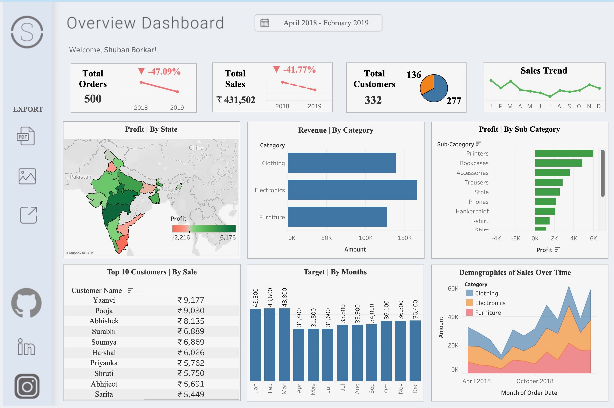

# 📊 E‑Commerce Dashboard (Tableau)

An interactive Tableau dashboard analyzing key metrics such as total orders, sales, customer trends, regional profit, and product performance using real-world e‑commerce data.

🔗 **Live Dashboard**: [View on Tableau Public](public.tableau.com/app/profile/shuban.borkar/viz/SuperStoreDashboard_17543406711030/Dashboard1#1)

---

## 📁 Datasets Used

Cleaned and integrated from the following three CSV files:

- `List of Orders.csv` – Contains all order transactions with IDs, dates, regions, customer names, etc.
- `Order Details.csv` – Breaks down each order by category, sub-category, product, price, and profit.
- `Sales Target.csv` – Monthly sales targets used to compare against actuals.

Original raw data sourced from:  
📌 [Kaggle – E‑Commerce Dataset by Ben Roshan](https://www.kaggle.com/datasets/benroshan/ecommerce-data)

---

## 🧼 Data Cleaning Process

Performed using Google Colab:
- Removed duplicates, nulls, and erroneous values (e.g., negative profits)
- Normalized column names, date formats, and merged based on common fields
- Aligned monthly targets with transactional data for accurate comparison

---

## 🎨 Dashboard Design & Layout

The design is inspired by [Priya Padham’s Superstore Dashboard](https://public.tableau.com/app/profile/p.padham/viz/SuperstoreDashboard_16709573699130/SuperstoreDashboard), but built with **completely different e‑commerce data and customized KPIs**.

### 📊 Features:

- 📉 KPI Cards with % Change (Orders, Sales, Customers)
- 🗺 Profit by State (map-based)
- 📦 Revenue by Category & Sub-category
- 👥 Top Customers by Sales
- 📈 Sales Trendline & Target by Month
- 📊 Sales Demographics Over Time (Stacked Area Chart)

---

## ⚒ Tools Used

- Tableau Public
- Python on Google Colab (for preprocessing)
- Data from Kaggle

---

## 📈 Key Insights

- ❌ Sales dropped by **41.77%** from 2018 to 2019
- 🧥 Clothing and Electronics dominate overall revenue
- 💰 Top 10 customers contributed significantly to revenue
- 📉 States like Tamil Nadu and Rajasthan show losses, while Karnataka leads in profit

---

## 🚀 Future Improvements

- Add interactivity with filters (Region, Category)
- Connect Tableau to a live data source (Google Sheets, PostgreSQL)
- Build a mobile-responsive dashboard version

---

## 🙏 Acknowledgements

- Dataset: [Ben Roshan on Kaggle](https://www.kaggle.com/datasets/benroshan/ecommerce-data)
- Dashboard layout reference: [Priya Padham](https://public.tableau.com/app/profile/p.padham)

---

📌 *Feel free to fork, explore, or suggest improvements via pull requests or issues!*

---

## Contact

**Shuban Borkar**  
Email: [shubanborkar@gmail.com](mailto:shubanborkar@gmail.com)  
LinkedIn: [shuban-borkar](https://www.linkedin.com/in/shuban-borkar)  
GitHub: [shubanborkar](https://github.com/shubanborkar)